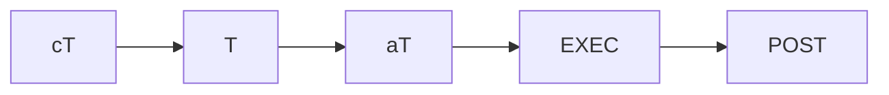

# Estado del Pipeline

*Actualizado por el Overseer en cada cambio de etapa. Rastrea el ciclo activo y el historial de todos los ciclos anteriores.*

## Ciclo Activo: C.v{}

### Estado Actual de Etapas

| Etapa | Estado |
|-------|--------|
| cT | ⏳ pendiente |
| T | ⬜ esperando |
| aT | ⬜ esperando |
| Build | ⬜ esperando |
| POST | ⬜ esperando |

## Historial de Ciclos

| Ciclo | Estado | Outcome Clave |
|-------|--------|---------------|
| C.v001 | ✅ completado | {resumen} |
| C.v002 | ⏳ activo | — |
| C.v003 | ⬜ futuro | — |

## Bloqueos

- Ninguno

## Notas

-

---
*Última actualización: {fecha}*
