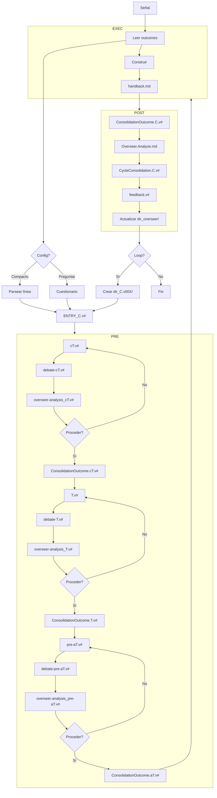

# Script de Flujo — Mapa de Proceso del Overseer

*El Overseer sigue este flujo a través de todos los ciclos. Cada ciclo itera PRE → EXEC → POST.*

## Pipeline Completo

## Puntos de Decisión

| # | Decisión | Quién | Opciones |
|---|----------|-------|----------|
| 1 | Formato de config | Humano | Línea compacta (`@ShitCodeImproveHard/ projectname: @...`) o Q&A interactivo |
| 2 | Proceder después de cT | Humano | Sí → outcome. No → revisar y debatir otra vez |
| 3 | Proceder después de T | Humano | Sí → outcome. No → revisar y debatir otra vez |
| 4 | Proceder después de aT | Humano | Sí → outcome. No → revisar y debatir otra vez |
| 5 | Loop al siguiente ciclo | Humano | Sí → crear nuevo dir de ciclo. No → terminar |
| 6 | Ajuste de metodología | Overseer | Usuario pregunta "qué metodología?" → Overseer pregunta contexto → recomienda o explica |
| 7 | Preferencia del usuario expresada | Overseer | Usuario dice "me gusta X" → Registrar en List:Yes. Usuario dice "evita Y" → Registrar en List:No |

## Qué Hace el Overseer en Cada Paso

| Paso | Acción |
|------|--------|
| Inicio | Leer protocolo, crear `ENTRY_C.v#.md`, escribir `pipeline-status.md` inicial |
| Después de debate cT | Escribir `overseer-analysis_cT#.v#.md` |
| Después de outcome cT | Actualizar `pipeline-status.md` (cT ✅) |
| Después de debate T | Escribir `overseer-analysis_T#.v#.md` |
| Después de outcome T | Actualizar `pipeline-status.md` (T ✅) |
| Después de debate aT | Escribir `overseer-analysis_pre-aT#.v#.md` |
| Después de outcome aT | Actualizar `pipeline-status.md` (aT ✅) |
| Después de EXEC | Actualizar `pipeline-status.md` (Build ✅) |
| POST: suma | Escribir `ConsolidationOutcome.C.v#.md` (como Strategist), luego `Overseer.Analyze.md` |
| POST: fusionar | Escribir `CycleConsolidation.C.v#.md` |
| POST: feedback | Escribir `feedback.v#.md` |
| POST: registrar | Actualizar `dir_overseer/journal.md`, `patterns.md`, `overseer-analysis.history.md`, `pipeline-status.md` |
| Loop | Crear `dir_C.v00X/` para el siguiente ciclo, escribir `HANDOFF_C.v#.md`, actualizar `pipeline-status.md` |

## Estados de Error

| Situación | Acción |
|-----------|--------|
| Humano rechaza teoría | Volver al Strategist: revisar y debatir otra vez |
| Build falla | Documentar en handback, proceder a POST igualmente |
| Humano no responde | Esperar. No proceder sin humano |
| Confusión de rol | Leer `role-Overseer.md`, `role-Strategist.md`, o `role-Builder.md` para re-centrarse |
