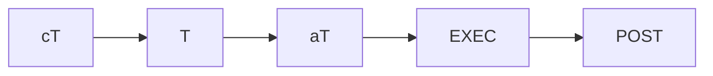

# Pipeline Status

*Updated by the Overseer at each stage change. Tracks the active cycle and history of all previous cycles.*

## Active Cycle: C.v{}

### Current Stage Status

| Stage | Status |
|-------|--------|
| cT | ⏳ pending |
| T | ⬜ waiting |
| aT | ⬜ waiting |
| Build | ⬜ waiting |
| POST | ⬜ waiting |

## Cycle History

| Cycle | Status | Key Outcome |
|-------|--------|-------------|
| C.v001 | ✅ complete | {summary} |
| C.v002 | ⏳ active | — |
| C.v003 | ⬜ future | — |

## Blockers

- None

## Notes

-

---
*Last updated: {date}*
