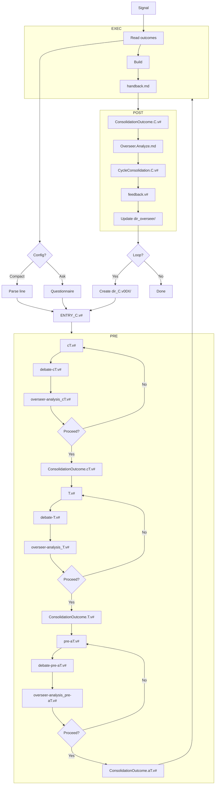

# Flowchart Script — Overseer Process Map

*The Overseer follows this flow across all cycles. Each cycle iterates through PRE → EXEC → POST.*

## Full Pipeline

## Decision Points

| # | Decision | Who | Options |
|---|----------|-----|---------|
| 1 | Config format | Human | Compact line (`@ShitCodeImproveHard/ projectname: @...`) or interactive Q&A |
| 2 | Proceed after cT | Human | Yes → outcome. No → revise and debate again |
| 3 | Proceed after T | Human | Yes → outcome. No → revise and debate again |
| 4 | Proceed after aT | Human | Yes → outcome. No → revise and debate again |
| 5 | Loop to next cycle | Human | Yes → create new cycle dir. No → finish |
| 6 | Methodology fit | Overseer | User asks "what methodology?" → Overseer asks context → recommends or explains |
| 7 | User preference expressed | Overseer | User says "I like X" → Log in List:Yes. User says "avoid Y" → Log in List:No |

## What the Overseer Does at Each Step

| Step | Action |
|------|--------|
| Start | Read protocol files, create `ENTRY_C.v#.md`, write initial `pipeline-status.md` |
| After cT debate | Write `overseer-analysis_cT#.v#.md` |
| After cT outcome | Update `pipeline-status.md` (cT ✅) |
| After T debate | Write `overseer-analysis_T#.v#.md` |
| After T outcome | Update `pipeline-status.md` (T ✅) |
| After aT debate | Write `overseer-analysis_pre-aT#.v#.md` |
| After aT outcome | Update `pipeline-status.md` (aT ✅) |
| After EXEC | Update `pipeline-status.md` (Build ✅) |
| POST: sum | Write `ConsolidationOutcome.C.v#.md` (as Strategist), then `Overseer.Analyze.md` |
| POST: fuse | Write `CycleConsolidation.C.v#.md` |
| POST: feedback | Write `feedback.v#.md` |
| POST: log | Update `dir_overseer/journal.md`, `patterns.md`, `overseer-analysis.history.md`, `pipeline-status.md` |
| Loop | Create `dir_C.v00X/` for next cycle, write `HANDOFF_C.v#.md`, update `pipeline-status.md` cycle history |

## Error States

| Situation | Action |
|-----------|--------|
| Human rejects theory | Loop back to Strategist: revise and debate again |
| Build fails | Document in handback, proceed to POST anyway |
| Human does not respond | Wait. Do not proceed without human |
| Role confusion | Read `role-Overseer.md`, `role-Strategist.md`, or `role-Builder.md` to re-center |
